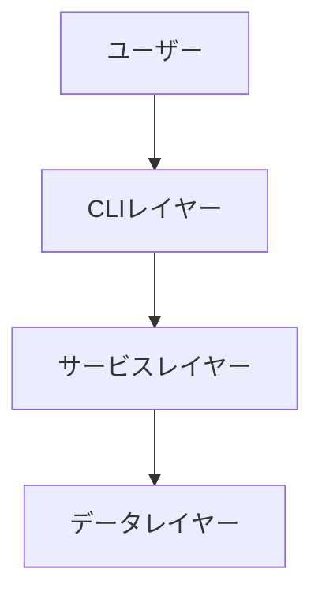
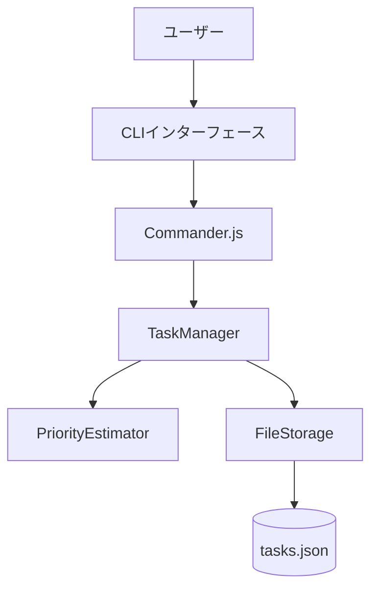
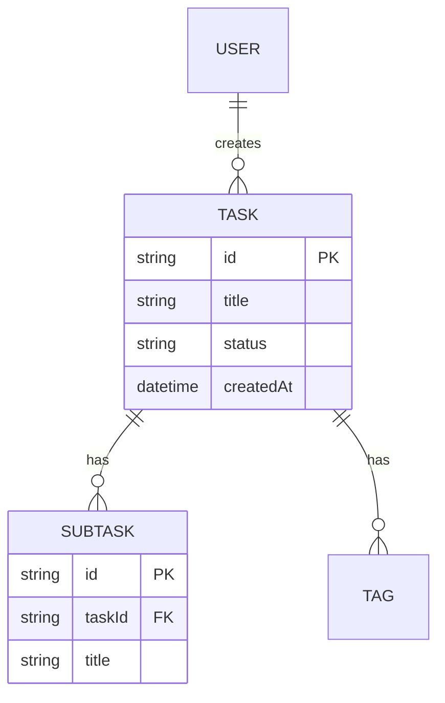
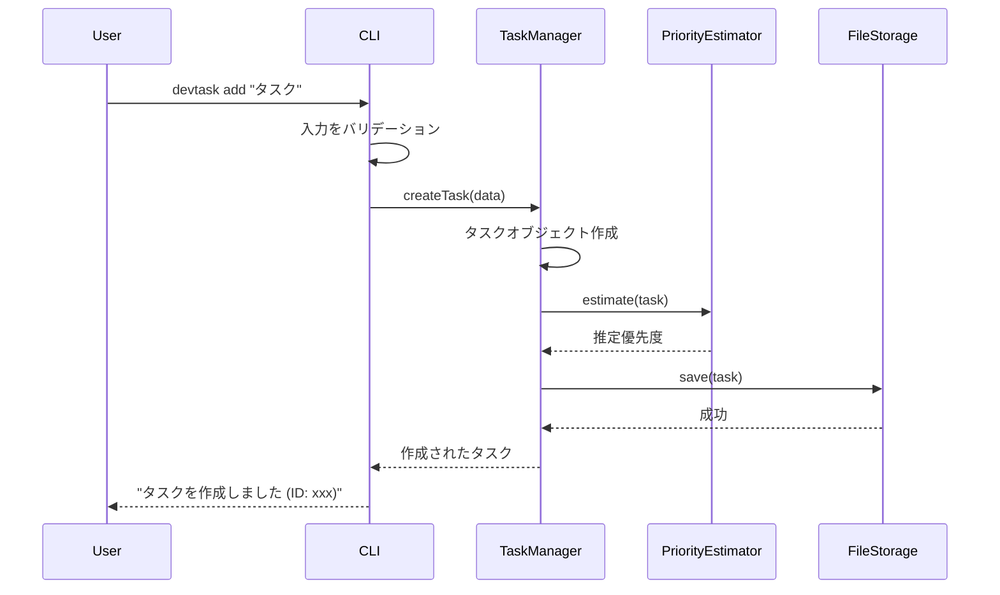

# 機能設計書作成ガイド

このガイドは、プロダクト要求定義書(PRD)に基づいて機能設計書を作成するための実践的な指針を提供します。

## 機能設計書の目的

機能設計書は、PRDで定義された「何を作るか」を「どう実現するか」に落とし込むドキュメントです。

**主な内容**:

- システム構成図
- データモデル
- コンポーネント設計
- アルゴリズム設計（該当する場合）
- UI設計
- エラーハンドリング

## 作成の基本フロー

### ステップ1: PRDの確認

機能設計書を作成する前に、必ずPRDを確認します。

```
Claude CodeにPRDから機能設計書を作成してもらう際のプロンプト例:

PRDの内容に基づいて機能設計書を作成してください。
特に優先度P0(MVP)の機能に焦点を当ててください。
```

### ステップ2: システム構成図の作成

#### Mermaid記法の使用

システム構成図はMermaid記法で記述します。

**基本的な3層アーキテクチャの例**:



**より詳細な例**:



### ステップ3: データモデル定義

#### TypeScript型定義で明確に

データモデルはTypeScriptのインターフェースで定義します。

**基本的なTask型の例**:

```typescript
interface Task {
  id: string; // UUID v4
  title: string; // 1-200文字
  description?: string; // オプション、Markdown形式
  status: TaskStatus; // 'todo' | 'in_progress' | 'completed'
  priority: TaskPriority; // 'high' | 'medium' | 'low'
  estimatedPriority?: TaskPriority; // 自動推定された優先度
  dueDate?: Date; // 期限
  createdAt: Date; // 作成日時
  updatedAt: Date; // 更新日時
  statusHistory?: StatusChange[]; // ステータス変更履歴
}

type TaskStatus = "todo" | "in_progress" | "completed";
type TaskPriority = "high" | "medium" | "low";

interface StatusChange {
  from: TaskStatus;
  to: TaskStatus;
  changedAt: Date;
}
```

**重要なポイント**:

- 各フィールドにコメントで説明を追加
- 制約（文字数、形式など）を明記
- オプションフィールドには`?`を付ける
- 型エイリアスで可読性を向上

#### ER図の作成

複数のエンティティがある場合、ER図で関連を示します。



### ステップ4: コンポーネント設計

各レイヤーの責務を明確にします。

#### CLIレイヤー

**責務**: ユーザー入力の受付、バリデーション、結果の表示

```typescript
// CommandLineInterface
class CLI {
  // ユーザー入力を受け付ける
  parseArguments(): Command;

  // 結果を表示する
  displayResult(result: Result): void;

  // エラーを表示する
  displayError(error: Error): void;
}
```

#### サービスレイヤー

**責務**: ビジネスロジックの実装

```typescript
// TaskManager
class TaskManager {
  // タスクを作成する
  createTask(data: CreateTaskData): Task;

  // タスク一覧を取得する
  listTasks(filter?: FilterOptions): Task[];

  // タスクを更新する
  updateTask(id: string, data: UpdateTaskData): Task;

  // タスクを削除する
  deleteTask(id: string): void;
}
```

#### データレイヤー

**責務**: データの永続化と取得

```typescript
// FileStorage
class FileStorage {
  // データを保存する
  save(data: any): void;

  // データを読み込む
  load(): any;

  // ファイルが存在するか確認する
  exists(): boolean;
}
```

### ステップ5: アルゴリズム設計（複雑なロジックがある場合のみ）

スコアリングや推定など、実装者が判断に迷うロジックがある場合のみ記述します。

**記述すべき内容**:

- 目的（何を計算するか）
- 入力と出力の型
- 分類の閾値や重み配分
- 擬似コードまたは簡略な実装例

実装の詳細はコードに委ね、設計書では**判断基準と閾値**の記述に留めます。

### ステップ6: ユースケース図

主要なユースケースをシーケンス図で表現します。

**タスク追加のフロー**:



### ステップ7: UI設計（該当する場合）

CLIツールの場合、テーブル表示やカラーコーディングを定義します。

#### テーブル表示

```
┌──────────┬──────────────────┬────────────┬──────────┬───────────────┐
│ ID       │ タイトル          │ ステータス   │ 優先度    │ 期限           │
├──────────┼──────────────────┼────────────┼──────────┼───────────────┤
│ 7a5c6ff0 │ 牛乳を買って帰る.   │ 未着手      │ 高       │ 2025-11-05    │
│          │                  │            │          │ (あと1日)      │
└──────────┴──────────────────┴────────────┴──────────┴───────────────┘
```

#### カラーコーディング

**ステータスの色分け**:

- 完了 (completed): 緑
- 進行中 (in_progress): 黄
- 未着手 (todo): 白

**優先度の色分け**:

- 高 (high): 赤
- 中 (medium): 黄
- 低 (low): 青

### ステップ8: ファイル構造（該当する場合）

データの保存形式を定義します。

**例: CLIツールのデータ保存**:

```
.devtask/
├── tasks.json      # タスクデータ
└── config.json     # 設定データ
```

**tasks.json の例**:

```json
{
  "tasks": [
    {
      "id": "7a5c6ff0-5f55-474e-baf7-ea13624d73a4",
      "title": "牛乳を買って帰る",
      "description": "",
      "status": "todo",
      "priority": "high",
      "estimatedPriority": "medium",
      "dueDate": "2025-11-05T00:00:00.000Z",
      "createdAt": "2025-11-04T10:00:00.000Z",
      "updatedAt": "2025-11-04T10:00:00.000Z"
    }
  ]
}
```

### ステップ9: エラーハンドリング

エラーの種類と処理方法を定義します。

| エラー種別             | 処理                             | ユーザーへの表示                                 |
| ---------------------- | -------------------------------- | ------------------------------------------------ |
| 入力検証エラー         | 処理を中断、エラーメッセージ表示 | "タイトルは1-200文字で入力してください"          |
| ファイル読み込みエラー | 空の初期データで継続             | "データファイルが見つかりません。新規作成します" |
| タスクが見つからない   | 処理を中断、エラーメッセージ表示 | "タスクが見つかりません (ID: xxx)"               |

## 機能設計書のレビュー

### レビュー観点

Claude Codeにレビューを依頼します:

```
この機能設計書を評価してください。以下の観点で確認してください:

1. PRDの要件を満たしているか
2. データモデルは具体的か
3. コンポーネントの責務は明確か
4. アルゴリズムは実装可能なレベルまで詳細化されているか
5. エラーハンドリングは網羅されているか
```

### 改善の実施

Claude Codeの指摘に基づいて改善します。

## まとめ

機能設計書作成の成功のポイント:

1. **PRDとの整合性**: PRDで定義された要件を正確に反映
2. **Mermaid記法の活用**: 図表で視覚的に表現
3. **TypeScript型定義**: データモデルを明確に
4. **詳細なアルゴリズム設計**: 複雑なロジックは具体的に
5. **レイヤー分離**: 各コンポーネントの責務を明確に
6. **実装可能なレベル**: 開発者が迷わず実装できる詳細度
