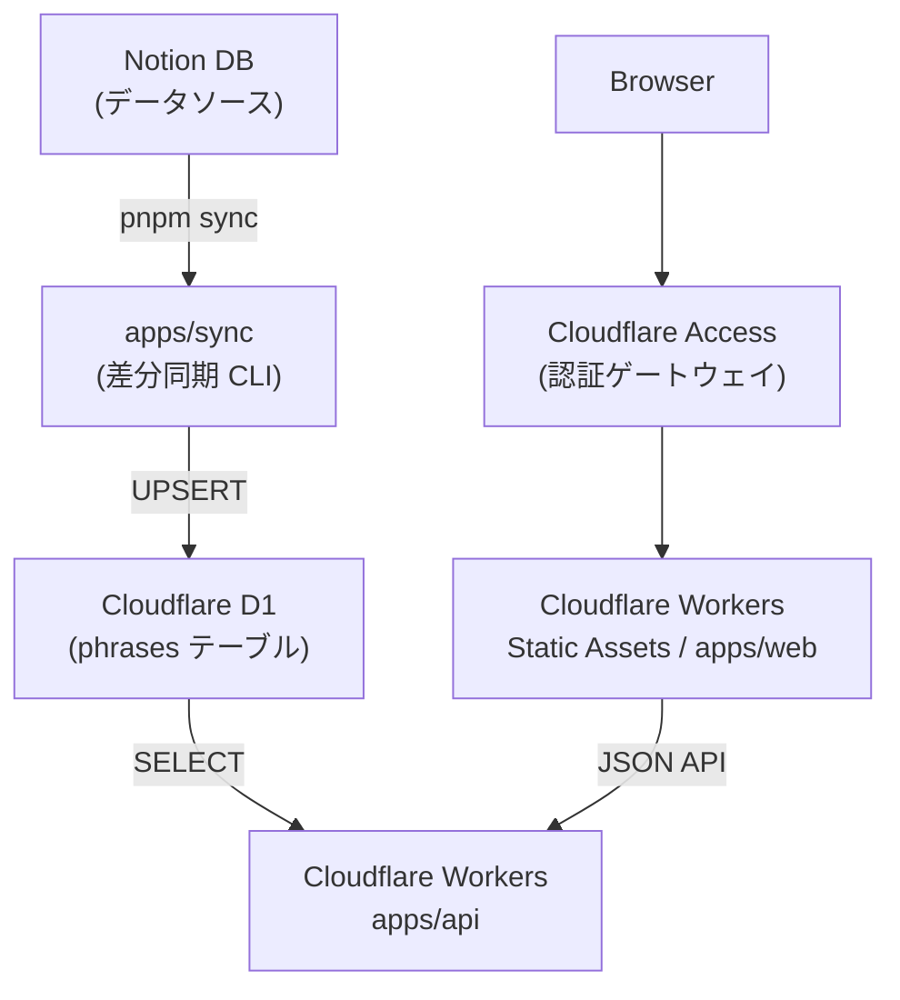

# english-phrase

英語フレーズ学習アプリ。Notion をデータソースとし、Cloudflare D1 に同期して提供する多フェーズプロジェクト。

## 構成図



## フェーズ構成

| フェーズ | 内容                                          | 状態   |
| -------- | --------------------------------------------- | ------ |
| Phase 1  | Notion → D1 差分同期 CLI                      | 完了   |
| Phase 2  | Cloudflare Workers API (ランダムフレーズ取得) | 完了   |
| Phase 3  | Web フロントエンド (学習 UI)                  | 進行中 |

## 技術スタック

- **Runtime**: Node.js >= 20.19.0 / TypeScript >= 5.0
- **Package Manager**: pnpm (ワークスペース)
- **Database**: Cloudflare D1 (SQLite)
- **ORM**: Drizzle ORM + drizzle-kit
- **Notion**: @notionhq/client
- **Frontend**: Vite + React 19 + TanStack Router / Query + shadcn/ui
- **Testing**: Vitest
- **Infra CLI**: Wrangler

## プロジェクト構造

```
english-phrase/
├── packages/
│   └── db/               # 共有 DB スキーマ (@english-phrase/db)
│       ├── src/schema.ts  # phrases / sync_logs テーブル定義
│       └── migrations/    # drizzle-kit 自動生成 SQL
├── apps/
│   ├── sync/             # Phase 1: Notion → D1 同期 CLI
│   ├── api/              # Phase 2: Cloudflare Workers API
│   └── web/              # Phase 3: Web フロントエンド (stub)
└── docs/                 # 設計ドキュメント
```

## セットアップ

```bash
pnpm install

# Cloudflare 認証
npx wrangler login

# D1 データベース作成
npx wrangler d1 create english-phrase-db

# マイグレーション適用
pnpm db:migrate
```

### 環境変数

`.env.example` をコピーして設定:

```bash
cp .env.example .env
```

| 変数名                  | 説明                              |
| ----------------------- | --------------------------------- |
| `NOTION_API_KEY`        | Notion インテグレーショントークン |
| `NOTION_DATABASE_ID`    | 同期元の Notion データベース ID   |
| `CLOUDFLARE_API_TOKEN`  | Cloudflare API トークン           |
| `CLOUDFLARE_ACCOUNT_ID` | Cloudflare アカウント ID          |
| `CF_D1_DATABASE_ID`     | D1 データベース UUID              |
| `D1_DB_NAME`            | D1 データベース名                 |

## 開発

### ローカル開発サーバーの起動

```bash
pnpm dev
```

DB (Drizzle Studio)・API (wrangler dev)・Web (Vite) の3サーバーを同時に起動します。

| サービス | URL |
| -------- | --- |
| Web フロントエンド | http://localhost:5173 |
| API (wrangler dev) | http://localhost:8787 |
| Drizzle Studio | https://local.drizzle.studio |

> **Note**: Vite の開発サーバーは `/api/*` へのリクエストを自動的に `http://localhost:8787` にプロキシします。フロントエンドコードからは `fetch("/api/v1/...")` と書くだけで API に接続できます。

> **Note**: `wrangler dev` はローカル SQLite で D1 をエミュレートします。初回のみ以下でローカル D1 にマイグレーションを適用してください。
> ```bash
> pnpm db:migrate:local
> ```

### 本番デプロイ

```bash
pnpm release
```

`pnpm api:deploy` と `pnpm web:deploy` を並列実行します。

> **Note**: DB マイグレーション (`pnpm db:migrate`) はスキーマ変更時のみ手動で実行してください。デプロイのたびに実行すると、テーブルが既に存在する場合にエラーになります。

### その他のコマンド

```bash
# Notion → D1 同期
pnpm sync

# テスト実行
pnpm test

# スキーマ変更後にマイグレーション生成
pnpm db:generate

# Web ビルド
pnpm web:build

# API 単体デプロイ
pnpm api:deploy

# Web 単体デプロイ
pnpm web:deploy
```

## DB 確認

```bash
npx wrangler d1 execute english-phrase-db \
  --remote --command="SELECT count(*) as total FROM phrases;"
```
