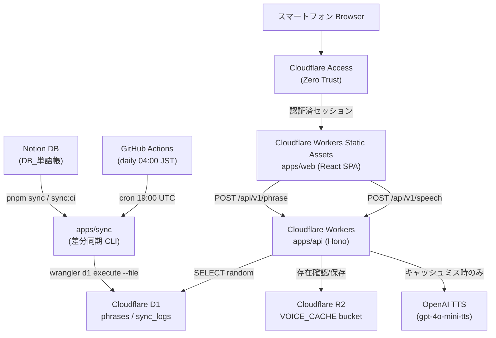
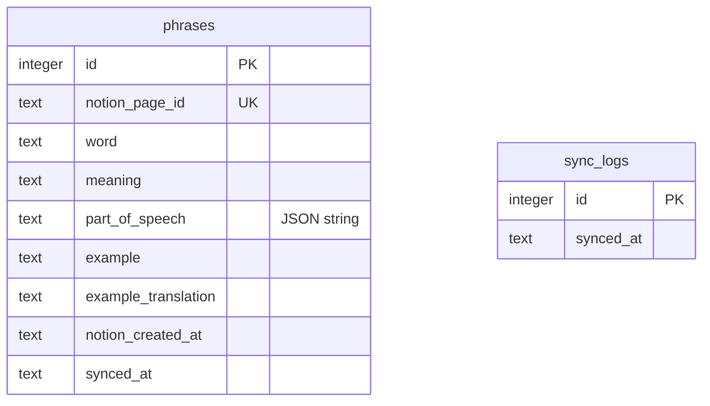
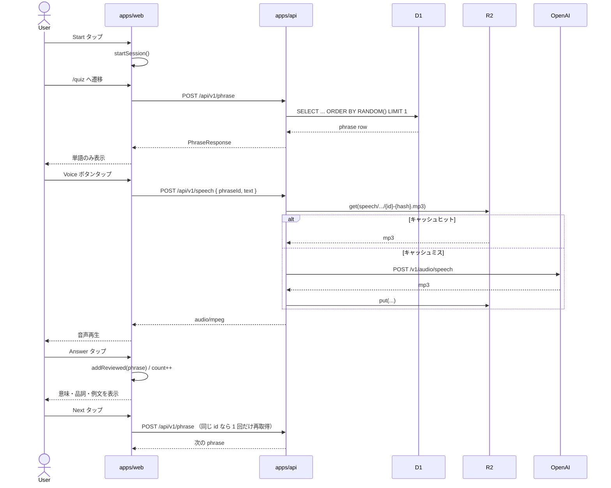
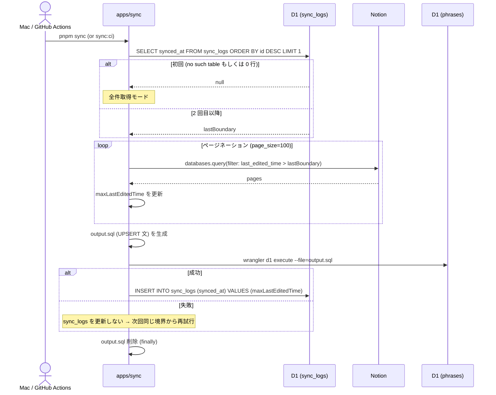
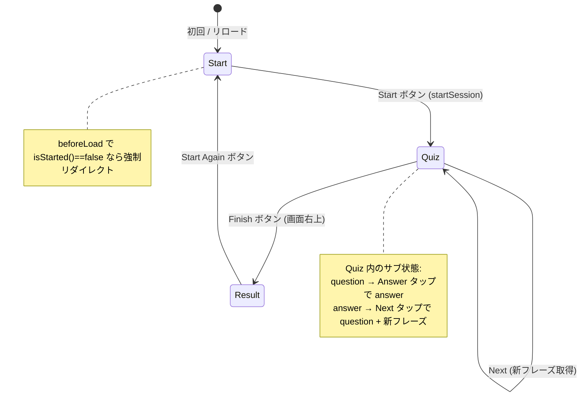

# 機能設計書 (Functional Design Document)

## システム構成図



## 機能一覧

| 機能 ID | 機能名             | 概要                                                | 担当アプリ      |
| ------- | ------------------ | --------------------------------------------------- | --------------- |
| F-01    | Notion → D1 差分同期 | Notion DB のページを `last_edited_time` で UPSERT   | `apps/sync`     |
| F-02    | ランダムフレーズ取得 | D1 から無作為に 1 件返す                            | `apps/api`      |
| F-03    | 音声生成・キャッシュ | `word` のmp3生成・R2キャッシュを介して返す          | `apps/api`      |
| F-04    | スタート画面         | セッション開始 → クイズへ                          | `apps/web`      |
| F-05    | クイズ画面           | 単語表示 → 解答表示 → 次へ。Voice ボタンで発音再生 | `apps/web`      |
| F-06    | 結果画面             | セッション中に確認した単語の一覧と件数を表示       | `apps/web`      |
| F-07    | 認証ゲート           | Cloudflare Access で許可メールのみ通す             | Cloudflare 設定 |
| F-08    | 自動同期 CI          | GitHub Actions が毎朝 sync を実行                  | `.github/workflows/sync.yml` |
| F-09    | 自動デプロイ CI      | `main` push で API / Web を本番デプロイ            | `.github/workflows/deploy.yml` |

## データモデル定義

### エンティティ: phrases

英単語・英フレーズの本体。Notion ページ 1 件と 1:1 対応する。

```typescript
// packages/db/src/schema.ts
export const phrases = sqliteTable("phrases", {
  id: int("id").primaryKey({ autoIncrement: true }),
  notionPageId: text("notion_page_id").notNull().unique(),
  word: text("word").notNull(),                    // 英単語・フレーズ本体
  meaning: text("meaning"),                         // 日本語訳
  partOfSpeech: text("part_of_speech"),             // JSON文字列: ["noun","verb"]
  example: text("example"),                         // 例文（複数行は "\n" 区切り）
  exampleTranslation: text("example_translation"),  // 例文訳（学習画面では未使用）
  notionCreatedAt: text("notion_created_at"),       // Notion 側 created_time (ISO8601)
  syncedAt: text("synced_at")
    .notNull()
    .default(sql`(datetime('now'))`),               // D1 への書き込み時刻
});
```

**制約**:

- `notion_page_id` は `UNIQUE`。UPSERT のキーとして使う。
- `word` は NOT NULL。Notion 側で `単語` が空のページは sync で除外する。
- `part_of_speech` は Notion の multi_select を JSON 文字列で保存（`["noun","verb"]` 形式）。
- 削除は行わない（Notion 側で削除しても D1 には残る）。

### エンティティ: sync_logs

差分同期の境界時刻を保持する。最新行の `synced_at` を「次回の `last_edited_time > boundary` フィルタの境界」として読み出す。

```typescript
export const syncLogs = sqliteTable("sync_logs", {
  id: int("id").primaryKey({ autoIncrement: true }),
  syncedAt: text("synced_at").notNull(),   // Notion ページの last_edited_time の最大値
});
```

**運用ルール**:

- D1 書き込みが成功した場合のみ INSERT する（リトライ安全性）。
- 取得ページ 0 件 & 境界に変化なしのときは INSERT しない。
- スキーマリセット時は `DELETE FROM sync_logs;` で初期化して全件再同期する。

### ER 図



`phrases` と `sync_logs` の間にリレーションは無い（`sync_logs` は同期実行のメタ情報のみ保持）。

### 共有型 (packages/types)

API と Web の境界で使う型を `packages/types/` で一元管理する。

```typescript
// packages/types/src/phrase.ts
export type PhraseResponse = {
  id: number;
  word: string;
  meaning: string | null;
  partOfSpeech: string | null;       // JSON文字列のままフロントに渡す
  example: string | null;
  exampleTranslation: string | null;
  notionCreatedAt: string | null;
};

// packages/types/src/speech.ts
export type SpeechRequest = {
  phraseId: number;
  text: string;
};

// packages/types/src/error.ts
export type ErrorResponse = { error: string };
```

## API 設計

API は `english-phrase.work/api/v1/*` で配信。フロント (`english-phrase.work/*`) と同一オリジンのため CORS は不要。Cloudflare Access により認証済みセッションでのみ到達できる。

### POST /api/v1/phrase

ランダムに 1 件返す。リクエストボディ無し。

**レスポンス**: `PhraseResponse`

```json
{
  "id": 123,
  "word": "run into",
  "meaning": "偶然出会う",
  "partOfSpeech": "[\"verb\"]",
  "example": "I ran into an old friend yesterday.",
  "exampleTranslation": "昨日、昔の友人に偶然会った。",
  "notionCreatedAt": "2025-01-15T03:00:00.000Z"
}
```

**エラー**:

- 404: `phrases` テーブルが空 → `{ "error": "No phrases found" }`

### POST /api/v1/speech

`word` の音声 mp3 を返す。R2 にキャッシュ済みなら OpenAI を呼ばずに返す。

**リクエスト**: `SpeechRequest`

```json
{ "phraseId": 123, "text": "run into" }
```

**レスポンス**: `Content-Type: audio/mpeg`（mp3 バイナリ）

**バリデーション**:

- `phraseId` が number でない → 400
- `text` が空文字 → 400
- `text` が 500 文字超 → 400
- OpenAI API 失敗 → 502

**キャッシュキー**:

```
speech/{MODEL}/{VOICE}/{phraseId}-{SHA-256(text)}.mp3
例) speech/gpt-4o-mini-tts/coral/123-7a3f...c2.mp3
```

`MODEL`・`VOICE`・`phraseId`・`text` のいずれかが変わると別オブジェクトになる。

## コンポーネント設計

### apps/sync — Notion 差分同期 CLI

**責務**:

- Notion DB から差分ページを取得する（初回は全件、2 回目以降は `last_edited_time > 境界` でフィルタ）。
- D1 の `phrases` テーブルへ UPSERT する。
- D1 書き込み成功後のみ `sync_logs` に境界を記録する。

**主要関数** (`apps/sync/src/index.ts`):

| 関数             | 役割                                              |
| ---------------- | ------------------------------------------------- |
| `main()`         | エントリポイント。境界取得→Notion取得→SQL生成→D1適用→境界更新 |
| `extractText`    | Notion `title` / `rich_text` プロパティを文字列化 |
| `extractMultiSelect` | `multi_select` を JSON 文字列にシリアライズ    |
| `extractCreatedTime` | `created_time` プロパティを ISO 文字列で取得   |
| `wranglerQuery`  | `wrangler d1 execute --command` のラッパー        |
| `advanceBoundary` | `sync_logs` を更新（境界が前進したときだけ）     |
| `esc()` (escape.ts) | SQL の文字列値をシングルクォートでエスケープ   |

**D1 への書き込み方式**:

- Drizzle は **スキーマ定義と型生成専用**で使う。Node から D1 への直接書き込み手段としては使わない。
- 各 phrase の UPSERT 文を 1 行ずつ生成し、`apps/sync/output.sql` に書き出す。
- `wrangler d1 execute --file=output.sql` でリモート（または `--local`）D1 に適用する。
- 適用成功後に `output.sql` を削除する（`finally` で必ず）。

**Notion → D1 カラムマッピング**:

| Notion プロパティ | 型           | D1 カラム             |
| ----------------- | ------------ | --------------------- |
| `単語`           | title        | `word`                |
| `意味`           | rich_text    | `meaning`             |
| `品詞`           | multi_select | `part_of_speech` (JSON) |
| `例文`           | rich_text    | `example`             |
| `例文訳`         | rich_text    | `example_translation` |
| `作成日時`       | created_time | `notion_created_at`   |
| page ID          | —            | `notion_page_id`      |

`チェック` `リセット` `赤シート` `数式` の各プロパティは無視する。

### apps/api — Cloudflare Workers API

**責務**:

- D1 からのランダムフレーズ取得 (`POST /api/v1/phrase`)
- OpenAI TTS + R2 キャッシュによる音声配信 (`POST /api/v1/speech`)

**ファイル構成**:

```
apps/api/src/
├── index.ts              # Hono アプリ初期化、ルート登録
├── routes/
│   ├── phrase.ts         # POST /phrase
│   └── speech.ts         # POST /speech、入力バリデーション
└── services/
    ├── speech.ts         # OpenAI TTS 呼び出し + R2 キャッシュ
    └── speech.test.ts    # ハッシュ・キャッシュキーのユニットテスト
```

**Bindings** (Workers 環境変数):

| バインディング      | 種別     | 用途                                |
| ------------------- | -------- | ----------------------------------- |
| `DB`                | D1       | `phrases` テーブル参照              |
| `VOICE_CACHE`       | R2       | mp3 キャッシュ                      |
| `OPENAI_API_KEY`    | Secret   | OpenAI API 認証                     |

### apps/web — React SPA

**責務**:

- スタート → クイズ → 結果 の 3 画面遷移を担う。
- API 呼び出し（`/api/v1/phrase`, `/api/v1/speech`）と表示制御。
- セッション状態（開始フラグ・確認済み一覧）をモジュールレベルで保持する（リロードで揮発）。

**主要ファイル**:

```
apps/web/src/
├── main.tsx                 # ルーター起動 / QueryClient / MSW (DEV) 初期化
├── constants.ts             # API_ENDPOINT / SPEECH_ENDPOINT
├── types/index.ts           # PageState = "question" | "answer"
├── routes/
│   ├── __root.tsx           # レイアウト + Toaster
│   ├── index.tsx            # スタート画面 ("/")
│   ├── quiz.tsx             # クイズ画面 ("/quiz")
│   └── result.tsx           # 結果画面 ("/result")
├── components/
│   ├── QuizCard.tsx         # 質問/解答を pageState で切替（旧 PhraseCard 統合形）
│   ├── ErrorMessage.tsx
│   └── ui/                  # shadcn 生成: button / badge / card / spinner
├── hooks/
│   ├── usePhrase.ts         # /phrase 取得・直前と同じ id の場合は1回だけ再取得
│   └── useVoice.ts          # /speech 取得・再生・状態管理
└── lib/
    ├── session.ts           # startSession / addReviewed / getReviewed
    └── utils.ts             # cn / parsePartOfSpeech
```

## ユースケース

### UC-01: 単語確認（クイズフロー）



### UC-02: Notion → D1 同期



## 画面遷移図



**画面遷移ガード**: `quiz.tsx` と `result.tsx` の `beforeLoad` で `isStarted()` を確認し、未開始なら `/` にリダイレクトする。リロードで `session.started = false` に戻るためホームに必ず戻る。

## UI 設計

### 全体方針

- スマートフォン専用レイアウト。PC は未サポート。
- UI 文言は英語のみ（`Start`, `Answer`, `Next`, `Finish`, `Start Again`, `Today's Results` など）。
- フォント: 英文 Roboto / 和文 Noto Sans。アイコン: Lucide。
- shadcn/ui スタイル: 当初 Lyra・Blue 系のテーマで設計（実装は Tailwind CSS 4 + shadcn cli）。
- safe-area-inset 対応: `pt-safe` / `pb-safe` を使ってホームインジケーター/ノッチを避ける。
- タッチターゲット: 主要ボタンは `h-14` 相当。

### Voice ボタンの状態

| 状態      | 表示                                  | クリック可否 |
| --------- | ------------------------------------- | ------------ |
| `idle`    | スピーカーアイコン (Volume2)         | 可           |
| `loading` | スピナー (Loader2 animate-spin)      | 不可         |
| `playing` | プライマリ色のスピーカー             | 不可         |

エラー時は `sonner` の `toast.error` で「音声の取得に失敗しました」「音声の再生に失敗しました」を表示する。

## アルゴリズム設計

### 直前のフレーズと同じ ID なら 1 回だけ再取得 (`usePhrase`)

**目的**: API がたまたま直前と同じ id を返したときに「同じ単語が連続して出る」のを避ける。

**ロジック** (`apps/web/src/hooks/usePhrase.ts`):

```typescript
let next = await fetchPhrase(signal);
if (prevIdRef.current !== null && next.id === prevIdRef.current) {
  next = await fetchPhrase(signal);   // 再取得は 1 回だけ
}
prevIdRef.current = next.id;
```

再取得後も同じ id だった場合はそのまま採用する（無限ループ防止）。`AbortController` で「Next 連打時の前リクエスト」をキャンセルする。

### R2 キャッシュキー生成 (`services/speech.ts`)

```typescript
const hash = sha256_hex(new TextEncoder().encode(text));
const key  = `speech/${MODEL}/${VOICE}/${phraseId}-${hash}.mp3`;
```

- `MODEL = "gpt-4o-mini-tts"` / `VOICE = "coral"` 固定。
- R2 `cache.get(key)` でヒットすれば mp3 を返す。
- ミスなら OpenAI を呼び、レスポンスを `cache.put(key, mp3, { httpMetadata: { contentType: "audio/mpeg" } })`。
- `put` の失敗はキャッシュ機能の劣化に留めるため `catch` で握りつぶし、生成済み mp3 はそのまま返す。

### Notion 差分取得の境界更新ルール (`apps/sync`)

- `archived === true` のページや `word` 空のページも `last_edited_time` の最大値計算には含める。
- これによって「archived のみ変更された Notion 変更」も次回 sync 時にスキップされる。
- D1 への書き込みが 0 件でも、境界が前進していれば `sync_logs` に記録する。
- D1 への書き込みが失敗した場合は `sync_logs` を更新しない（リトライ時に同じ境界から再取得）。

## ファイル構造（同期スクリプトの一時ファイル）

```
apps/sync/
├── src/
│   ├── index.ts
│   ├── escape.ts
│   └── escape.test.ts
├── output.sql        # 同期実行時のみ生成、適用後に削除（.gitignore 済み）
└── package.json
```

`output.sql` 例:

```sql
INSERT INTO phrases (notion_page_id, word, meaning, part_of_speech, example, example_translation, notion_created_at)
VALUES ('abcd-...', 'run into', '偶然出会う', '["verb"]', 'I ran into ...', '昨日 ...', '2025-01-15T03:00:00.000Z')
ON CONFLICT(notion_page_id) DO UPDATE SET word=excluded.word, meaning=excluded.meaning, part_of_speech=excluded.part_of_speech, example=excluded.example, example_translation=excluded.example_translation, synced_at=datetime('now');
```

## エラーハンドリング

### apps/sync

| エラー種別                              | 処理                                            | 終了コード |
| --------------------------------------- | ----------------------------------------------- | ---------- |
| 必須環境変数欠落                        | `throw new Error()` で即中断                    | 1          |
| `no such table` (sync_logs 未作成)      | 初回扱いで全件取得モードへ遷移                  | 続行       |
| sync_logs 読み取りのその他失敗          | 例外を再 throw し、`main().catch()` で `exit 1` | 1          |
| Notion API 失敗 / `wrangler d1 execute` 失敗 | 例外をそのまま伝播 → `exit 1`              | 1          |
| `word` が空のページ                     | `console.warn` してスキップ                     | 続行       |
| `output.sql` 削除失敗                   | 無視（`fs.rmSync({ force: true })`）            | —          |

### apps/api

| エラー種別                        | HTTP | レスポンス                                      |
| --------------------------------- | ---- | ----------------------------------------------- |
| `phrases` テーブルが空            | 404  | `{ "error": "No phrases found" }`               |
| 不正な JSON ボディ                | 400  | `{ "error": "Invalid JSON body" }`              |
| `phraseId` が number でない       | 400  | `{ "error": "phraseId must be a number" }`      |
| `text` 空                          | 400  | `{ "error": "text is required" }`               |
| `text` が 500 文字超              | 400  | `{ "error": "text must be 500 characters or less" }` |
| OpenAI 失敗                       | 502  | `{ "error": "Failed to generate speech" }`      |
| R2 `put` 失敗                     | —    | console.error で記録、生成済み mp3 はそのまま返す |

### apps/web

| エラー種別                  | UI                                           |
| --------------------------- | -------------------------------------------- |
| `/api/v1/phrase` 失敗       | クイズ画面に `ErrorMessage` + Retry ボタン   |
| `/api/v1/speech` 失敗       | `toast.error("音声の取得に失敗しました")`    |
| 音声再生失敗 (`audio.error`) | `toast.error("音声の再生に失敗しました")`    |
| `AbortError`                 | 無視（Next 連打などによる意図的キャンセル） |

## テスト戦略

### ユニットテスト (Vitest)

- `apps/sync/src/escape.test.ts` — SQL 文字列エスケープの正常系・null/undefined・複数クォート
- `apps/api/src/services/speech.test.ts` — `textHash` / `buildCacheKey` の純粋関数テスト

### 手動動作確認

- ローカル: `pnpm dev` で DB Studio + Workers dev + Vite を同時起動し、`http://localhost:5173` で動作確認。`/api/*` は Vite が `http://localhost:8787` にプロキシ。
- 本番: GitHub Actions による自動デプロイ後、`https://english-phrase.work` にアクセスして Cloudflare Access ログイン → 学習フロー → 音声再生（1 回目は OpenAI、2 回目は R2 キャッシュから）を確認。

### CI

- `apps/sync` と `apps/api` で `pnpm test` が走る（`apps/web` には現状ユニットテストはなく Storybook のみ）。
- `vitest` は workers バインディングを mock しない範囲（純粋関数）のみ対象。
