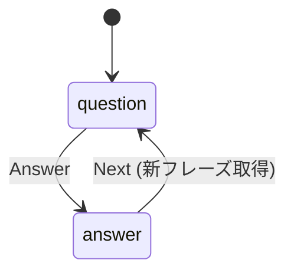
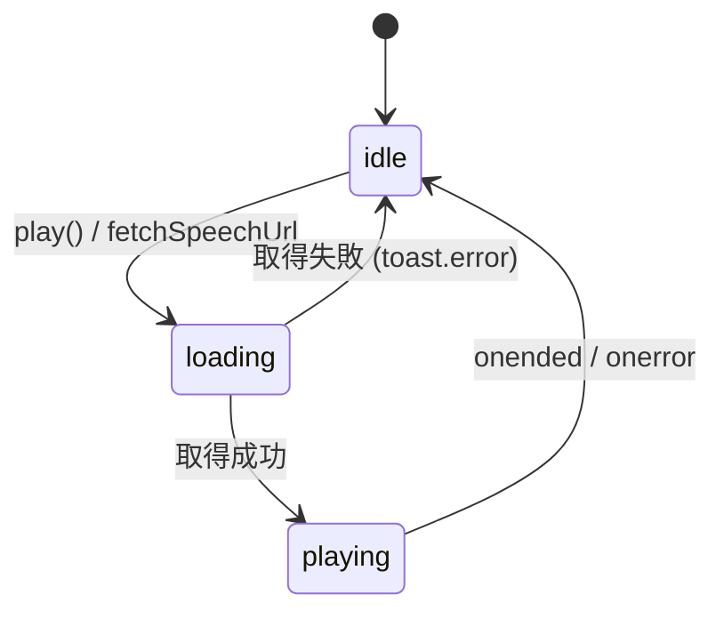

# プロジェクト用語集 (Glossary)

## 概要

このドキュメントは english-phrase プロジェクトで使われる用語を一元管理する。同じ概念に複数の呼び方が混在しないよう、PRD・機能設計書・コード内で使う名前は本ドキュメントを正とする。

**更新日**: 2026-05-12

## ドメイン用語

学習体験・データに関する固有概念。

### Phrase（フレーズ / 単語）

**定義**: 学習対象となる英語の 1 単位。英単語 1 語、句動詞、短いイディオムや慣用句までを含む。

**説明**: Notion DB `DB_単語帳` の 1 ページが Phrase 1 件に対応する。D1 では `phrases` テーブルの 1 行。`word` プロパティが本体で、補助情報として `meaning`（意味）、`partOfSpeech`（品詞）、`example`（例文）、`exampleTranslation`（例文訳）を持つ。

**関連用語**: Word、Meaning、Example、Notion Page ID

**英語表記**: Phrase（コード内）／単語、フレーズ（UI 上は英語のみ。日本語は内部議論用）

### Word

**定義**: Phrase の本体テキスト（英語）。例: `serendipity`, `run into`, `as a matter of fact`。

**説明**: `phrases.word` カラム。NOT NULL。学習画面では最初にこれだけが表示される。音声読み上げの対象は **word のみ**。

**使用例**:

- クイズ画面で `phrase.word` を中央に大きく表示する
- `/api/v1/speech` のリクエストに `text: phrase.word` を渡す

### Meaning（意味）

**定義**: Word の日本語訳。

**説明**: `phrases.meaning` カラム（nullable）。Answer ボタン押下後に表示される。

### Example（例文）

**定義**: Word を使った英語例文。複数行は `\n` 区切りで保存される。

**説明**: `phrases.example` カラム（nullable）。Answer 押下後にリスト形式で表示される（行ごとに `<li>`）。

### Example Translation（例文訳）

**定義**: Example の日本語訳。

**説明**: `phrases.example_translation` カラム（nullable）。**学習画面では表示しない**（PRD 上意図的に省略）。Notion 側に保存はするが UI には出さない。

### Part of Speech（品詞）

**定義**: Word の品詞。複数指定可（例: 動詞かつ前置詞句）。

**説明**: Notion 側は `multi_select` 型で、`["verb", "preposition"]` のような形で複数選択可能。D1 では JSON 文字列としてそのまま保存する（`phrases.part_of_speech`）。フロントでは `parsePartOfSpeech()` で配列に戻して Badge 表示する。

**使用例**: `["noun", "adjective"]` → 画面に `[noun]` `[adjective]` の 2 つの Badge を表示

### Session（セッション）

**定義**: Start ボタン押下から、結果画面・リロードまでの 1 連の学習。

**説明**: ブラウザのメモリ（`apps/web/src/lib/session.ts` のモジュールスコープ変数）に保持する。永続化しない。リロードで揮発し、Start 画面に戻る。`startSession()` で初期化、`addReviewed()` で学習済みを追加、`getReviewed()` で結果画面が読み出す。

**関連用語**: Reviewed Phrase

### Reviewed Phrase（確認済みフレーズ）

**定義**: 現在のセッション中で Answer ボタンを押した Phrase のレコード。

**説明**: `lib/session.ts` の `ReviewedRecord` 型。`PhraseRecord`（id・word・meaning・partOfSpeech・example）に `reviewId`（UUID）を加える。同じ Phrase が複数回登場しても結果画面の React key が衝突しないようにするための識別子。

### 差分同期 (Differential Sync)

**定義**: Notion DB と D1 を Notion の `last_edited_time` を境界として差分更新する仕組み。

**説明**: 初回は全件 INSERT、2 回目以降は前回境界以降に更新されたページのみ取得して UPSERT する。D1 書き込み成功後にのみ境界を更新するため、失敗時は同じ境界からリトライ可能。

**関連用語**: Sync Boundary、sync_logs

### Sync Boundary（同期境界）

**定義**: 「ここまでは既に取り込み済み」を示す `last_edited_time` の最大値。

**説明**: `sync_logs.synced_at` の最新行が次回の境界として使われる。Notion API の filter (`last_edited_time` > 境界) でこの値を使う。境界更新は D1 への書き込み成功後にのみ実行する。

### Voice ボタン

**定義**: クイズ画面の音声再生ボタン。

**説明**: スピーカーアイコン（Lucide `Volume2`）。`useVoice` フックで状態管理し、`idle` / `loading` / `playing` の 3 状態を持つ。`loading` 中はスピナーに切り替わり、`disabled` になる。

## 技術用語

外部技術・サービス・ライブラリの説明。

### Cloudflare D1

**定義**: Cloudflare が提供する Workers 向けのサーバーレス SQLite データベース。

**公式**: https://developers.cloudflare.com/d1/

**本プロジェクトでの用途**: `phrases` と `sync_logs` の保存。Worker からは `drizzle-orm/d1` でクエリ。CLI からは `wrangler d1 execute` で SQL を流し込む。

### Cloudflare R2

**定義**: Cloudflare のオブジェクトストレージ（S3 互換、エグレス無料）。

**公式**: https://developers.cloudflare.com/r2/

**本プロジェクトでの用途**: OpenAI が生成した mp3 を `english-phrase-voice-cache` バケットにキャッシュ。Worker からは `VOICE_CACHE` バインディング経由でアクセス。

### Cloudflare Workers

**定義**: Cloudflare のエッジで動くサーバーレスランタイム。

**公式**: https://developers.cloudflare.com/workers/

**本プロジェクトでの用途**: `apps/api`（Hono アプリ）と `apps/web`（Static Assets）の 2 つの Worker。Worker Route で同一オリジン配信する。

### Cloudflare Workers Static Assets

**定義**: Workers で静的ファイル（SPA など）を配信する機構。

**本プロジェクトでの用途**: `apps/web/wrangler.toml` の `[assets] directory = "./dist"` で Vite ビルド成果物を Worker から配信する。`not_found_handling = "single-page-application"` で SPA ルーティングに対応。

### Cloudflare Access (Zero Trust)

**定義**: Cloudflare の認証ゲートウェイ。指定したメール / SSO のみがアプリにアクセスできる。

**公式**: https://developers.cloudflare.com/cloudflare-one/applications/

**本プロジェクトでの用途**: `english-phrase.work` 全体に Self-hosted Application を設定し、許可メールのみログイン可能にする。Worker 内では追加の認証チェックは実装していない（境界防御一本）。

### Cloudflare Worker Route

**定義**: Workers が処理する URL パターンの設定。

**本プロジェクトでの用途**: `english-phrase.work/api/*` を API Worker に、それ以外を Web Worker に振り分ける。

### Hono

**定義**: Cloudflare Workers をはじめとするエッジランタイム向けの軽量 Web フレームワーク。

**公式**: https://hono.dev/

**バージョン**: ^4.0.0

**本プロジェクトでの用途**: `apps/api` の HTTP ルーティング。`new Hono<{ Bindings: ... }>()` で Workers バインディングに型を付ける。

### Drizzle ORM

**定義**: TypeScript ファーストの軽量 SQL ORM。SQLite / Postgres / MySQL / D1 などを扱える。

**公式**: https://orm.drizzle.team/

**本プロジェクトでの用途**:

- `packages/db/src/schema.ts` でスキーマ定義（単一の SoT）
- `apps/api` で `drizzle-orm/d1` を使った型安全なクエリ
- `apps/sync` では型 (`NewPhrase`) のみインポートし、ランタイム DB アクセスは持たない

### drizzle-kit

**定義**: Drizzle のマイグレーション SQL 生成 CLI。

**本プロジェクトでの用途**: `pnpm db:generate` で `schema.ts` から `migrations/NNNN_*.sql` を自動生成。`pnpm db:studio` で Drizzle Studio（GUI）を起動。

### Wrangler

**定義**: Cloudflare の公式 CLI。Workers / Pages / D1 / R2 などを操作する。

**公式**: https://developers.cloudflare.com/workers/wrangler/

**バージョン**: ^4.0.0（pnpm-workspace.yaml の catalog で集約）

**本プロジェクトでの用途**: D1 マイグレーション適用、Workers デプロイ、ローカル開発サーバ（`wrangler dev`）、Secrets 登録（`wrangler secret put`）。`apps/sync` からは `execFileSync` で呼び出す。

### TanStack Router

**定義**: 型安全なファイルベース React ルーター。

**公式**: https://tanstack.com/router

**本プロジェクトでの用途**: `apps/web/src/routes/` 配下のファイル名がルートになる。`beforeLoad` で認可ガード（`isStarted()` 未開始ならホームへリダイレクト）。`routeTree.gen.ts` は Vite プラグインが自動生成する。

### TanStack Query

**定義**: サーバ状態管理（Stale-While-Revalidate）ライブラリ。

**本プロジェクトでの用途**: Router の Context として `QueryClient` を注入してあるが、現状の API 呼び出しは `usePhrase` / `useVoice` の手書きで完結している。将来のキャッシュ管理のために置いてある。

### shadcn / shadcn-ui

**定義**: Radix UI と Tailwind CSS をベースに、コンポーネントを「コピー & 編集可能な形でリポジトリに置く」アプローチを取る UI ライブラリ。

**公式**: https://ui.shadcn.com/

**本プロジェクトでの用途**: `apps/web/src/components/ui/`（button / badge / card / spinner）。`shadcn` CLI で追加する。手書きで足さない。

### Tailwind CSS v4

**定義**: ユーティリティファースト CSS フレームワーク。

**バージョン**: ^4.1.3（@tailwindcss/vite プラグイン経由で Vite と統合）

**本プロジェクトでの用途**: `apps/web/src/styles/globals.css` で初期化。shadcn 生成コンポーネントが利用。

### MSW (Mock Service Worker)

**定義**: ブラウザ・Node の双方で `fetch` をインターセプトしてモックレスポンスを返すライブラリ。

**公式**: https://mswjs.io/

**本プロジェクトでの用途**: `apps/web` で `VITE_ENABLE_MSW=true` の環境変数が設定されたときのみ起動（`src/main.tsx`）。`src/mocks/handlers.ts` で `/api/v1/*` をモック化する。

### Vitest

**定義**: Vite ベースのユニットテストランナー。

**本プロジェクトでの用途**: `apps/sync` と `apps/api` の純粋関数テスト。`apps/web` には Vitest ^4 が入っているが、ユニットテストはまだ書かれていない（Storybook + 手動確認に依存）。

### Storybook

**定義**: UI コンポーネントを単体でカタログ表示・テストできるツール。

**本プロジェクトでの用途**: `apps/web/.storybook/` を設定。現状は `ErrorMessage.stories.tsx` のみ。`pnpm storybook` で 6006 ポート起動。

### Biome

**定義**: Rust 製の高速 Lint + Formatter + Import 整列ツール。

**公式**: https://biomejs.dev/

**バージョン**: 2.4.11

**本プロジェクトでの用途**: ルート `biome.json` で全パッケージ共通設定。`pnpm check` で一括実行。`prettier` / `eslint` は使わない。

### Sonner

**定義**: React 向けの Toast 通知ライブラリ。

**本プロジェクトでの用途**: 音声取得・再生のエラー通知。`<Toaster position="bottom-center" />` を `__root.tsx` に配置。

### OpenAI TTS / gpt-4o-mini-tts

**定義**: OpenAI の Text-to-Speech API モデル。

**公式**: https://platform.openai.com/docs/models/gpt-4o-mini-tts

**本プロジェクトでの用途**: `apps/api/src/services/speech.ts` から `POST /v1/audio/speech` を叩く。`voice: "coral"`、`response_format: "mp3"`、`instructions: "Speak clearly at a natural pace for English learners."`。

### Notion API

**定義**: Notion DB を読み書きする REST API。

**公式**: https://developers.notion.com/

**本プロジェクトでの用途**: `apps/sync` から `@notionhq/client` 経由で `databases.query` を呼ぶ。`last_edited_time` フィルタで差分のみ取得。

## 略語・頭字語

### PRD

**正式名称**: Product Requirements Document

**意味**: プロダクト要求定義書。`docs/product-requirements.md`。

### SPA

**正式名称**: Single Page Application

**意味**: 1 ページの中でルーティング・画面切替を完結する Web アプリ。`apps/web` がこれ。

### TTS

**正式名称**: Text-to-Speech

**意味**: テキスト読み上げ。本プロジェクトでは OpenAI の TTS API を指す。

### CI / CD

**正式名称**: Continuous Integration / Continuous Deployment

**意味**: GitHub Actions による自動 Sync (`sync.yml`) と自動デプロイ (`deploy.yml`)。

### SoT

**正式名称**: Source of Truth

**意味**: 単一の信頼できる定義元。本プロジェクトでは `packages/db/src/schema.ts` が DB スキーマの SoT。

### UPSERT

**意味**: 該当行があれば UPDATE、無ければ INSERT。SQLite では `INSERT ... ON CONFLICT(...) DO UPDATE SET ...`。Notion → D1 同期の中核。

### SoC

**正式名称**: Separation of Concerns

**意味**: 責務分離。本プロジェクトでは route / service / hook / component / lib のレイヤー分割で実現。

### SRS

**正式名称**: Spaced Repetition System

**意味**: 間隔反復学習システム（Anki などが該当）。PRD で「やらないこと」として明示している。

## アーキテクチャ用語

### Workspaces / Monorepo

**定義**: 複数の独立したパッケージを 1 つのリポジトリ・1 つの依存ツリーで管理する構造。

**本プロジェクトでの適用**: pnpm workspaces で `packages/*` と `apps/*` を管理。`workspace:*` プロトコルでローカル参照する。

### Single Origin（同一オリジン構成）

**定義**: フロントエンドと API を同一のスキーム + ホスト + ポートで配信する構成。

**本プロジェクトでの適用**: `english-phrase.work` 配下に Web と API を Worker Route で振り分けて配信。CORS が不要になり、Cookie ベースの Cloudflare Access セッションがそのまま使える。

### Bindings（Workers バインディング）

**定義**: Cloudflare Workers がランタイムから利用する D1 / R2 / KV / Secret などの参照。`wrangler.toml` で宣言し、Workers コードでは `c.env.DB` のような型付きオブジェクトとして渡される。

**本プロジェクトでの適用**: `DB`（D1）、`VOICE_CACHE`（R2）、`OPENAI_API_KEY`（Secret）の 3 つ。

### Worker Secret

**定義**: Cloudflare Workers にバインドされる暗号化された環境変数。`wrangler secret put` で登録し、ダッシュボードや wrangler.toml には出ない。

**本プロジェクトでの適用**: `OPENAI_API_KEY` を Secret として登録。

### Cache-Aside パターン

**定義**: 「キャッシュを見て、なければソースから取得して、結果をキャッシュに書き込む」というキャッシュ戦略。

**本プロジェクトでの適用**: `apps/api/src/services/speech.ts` の `getOrGenerate()`。R2 を見る → なければ OpenAI 呼び出し → R2 に保存 → mp3 を返す。

## ステータス・状態

### PageState（クイズ画面のサブ状態）

| 値        | 意味                                | 遷移条件                       |
| --------- | ----------------------------------- | ------------------------------ |
| `question` | 単語のみ表示。Answer ボタンが見える | 初期、または Next クリック後   |
| `answer`  | 意味・品詞・例文も表示。Next が見える | Answer クリック                |



### VoiceState（音声ボタンの状態）

| 値        | UI                              | 遷移                              |
| --------- | ------------------------------- | --------------------------------- |
| `idle`    | スピーカーアイコン (Volume2)    | 初期。クリックで `loading` へ     |
| `loading` | スピナー (Loader2 animate-spin) | 音声 URL 取得中。完了で `playing` |
| `playing` | プライマリ色のスピーカー        | 再生中。`onended` で `idle` へ    |



### Session State（学習セッション）

| プロパティ        | 型                  | 意味                                       |
| ----------------- | ------------------- | ------------------------------------------ |
| `started`         | `boolean`           | Start ボタンが押されたか                   |
| `reviewedPhrases` | `ReviewedRecord[]`  | Answer を押した Phrase のスナップショット列 |

リロードで両方リセット → ホーム画面に戻る。

## データモデル用語

### phrases

**定義**: 学習対象 Phrase の本体テーブル。

**主要フィールド**:

- `id` (integer, PK, AUTOINCREMENT)
- `notion_page_id` (text, UNIQUE, NOT NULL): Notion ページ ID。UPSERT のキー
- `word` (text, NOT NULL): 英単語・フレーズ本体
- `meaning` (text, nullable): 日本語訳
- `part_of_speech` (text, nullable): JSON 文字列 `["noun","verb"]`
- `example` (text, nullable): 例文（複数行は `\n` 区切り）
- `example_translation` (text, nullable): 例文訳
- `notion_created_at` (text, nullable): Notion 側 created_time (ISO 8601)
- `synced_at` (text, NOT NULL, default `datetime('now')`): D1 への書き込み時刻

**制約**: `notion_page_id` の UNIQUE 制約が UPSERT の前提。

### sync_logs

**定義**: 差分同期の境界時刻を記録するテーブル。

**主要フィールド**:

- `id` (integer, PK, AUTOINCREMENT)
- `synced_at` (text, NOT NULL): Notion ページの `last_edited_time` の最大値

**運用**: D1 書き込み成功時のみ INSERT。スキーマ破壊時は `DELETE FROM sync_logs;` で初期化して全件再同期する。

## エラー・例外

### Sync エラー

| 種別                              | 発生                              | 処理                            |
| --------------------------------- | --------------------------------- | ------------------------------- |
| 必須環境変数欠落                  | 起動時の `process.env` チェック   | `throw new Error()` → exit 1   |
| `no such table` (sync_logs 未作成) | 初回起動時                        | 初回扱いで全件取得モードに遷移 |
| Notion / wrangler 失敗            | API 呼び出し時                    | 例外伝播 → `main().catch` で exit 1 |

### API エラーレスポンス

すべて `ErrorResponse = { error: string }` 形式で返す。

| ステータス | 状況                                        | エラーメッセージ例                          |
| ---------- | ------------------------------------------- | ------------------------------------------- |
| 400        | `phraseId` が number でない                  | `"phraseId must be a number"`               |
| 400        | `text` が空                                  | `"text is required"`                        |
| 400        | `text` が 500 文字超                         | `"text must be 500 characters or less"`     |
| 400        | リクエストボディが不正な JSON               | `"Invalid JSON body"`                       |
| 404        | `phrases` テーブルが空                       | `"No phrases found"`                        |
| 502        | OpenAI API 呼び出し失敗                      | `"Failed to generate speech"`               |

### Web のユーザー向けエラー

| 場面                          | 表示                                              |
| ----------------------------- | ------------------------------------------------- |
| `/api/v1/phrase` 失敗         | `<ErrorMessage>` + Retry ボタン                   |
| `/api/v1/speech` 取得失敗     | `toast.error("音声の取得に失敗しました")`         |
| `<audio>` 再生失敗             | `toast.error("音声の再生に失敗しました")`         |
| `AbortError`                   | 無視（意図的キャンセル）                          |

## アルゴリズム / 計算ロジック

### R2 キャッシュキー

**目的**: model / voice / phraseId / text が同じであればキャッシュヒットさせる。

**計算式**:

```
key = `speech/${MODEL}/${VOICE}/${phraseId}-${SHA-256_hex(text)}.mp3`
```

**実装箇所**: `apps/api/src/services/speech.ts` (`textHash`, `buildCacheKey`)

**例**:

```
入力: phraseId=123, text="run into", MODEL="gpt-4o-mini-tts", VOICE="coral"
出力: speech/gpt-4o-mini-tts/coral/123-7a3f...c2.mp3
```

### 重複フレーズ回避（1 回再取得）

**目的**: 直前と同じ id のレコードが返ってきたら、もう一度だけ API を叩いて違うものを引く。

**ロジック**:

```typescript
let next = await fetchPhrase(signal);
if (prevIdRef.current !== null && next.id === prevIdRef.current) {
  next = await fetchPhrase(signal);  // 1 回だけ
}
prevIdRef.current = next.id;
```

**実装箇所**: `apps/web/src/hooks/usePhrase.ts`

**特性**: 無限ループしない。再取得後も同じ id なら諦めて採用する。

### 差分同期の境界更新

**目的**: D1 反映成功時のみ境界を進めて、失敗時には次回も同じ境界からリトライ可能にする。

**ロジック**:

1. Notion から取得したページのうち `last_edited_time` の最大値 (`maxLastEditedTime`) を計算
2. `archived` ページや `word` 空のページも最大値計算には含める
3. `wrangler d1 execute --file=output.sql` が成功した場合のみ `INSERT INTO sync_logs (...)`
4. ページ 0 件 & 境界に変化なしのときは INSERT しない

**実装箇所**: `apps/sync/src/index.ts` の `advanceBoundary()`

## 変更履歴

| 日付       | 変更内容                | 対象用語  |
| ---------- | ----------------------- | --------- |
| 2026-05-12 | 初版作成（既存実装から抽出） | 全項目 |
